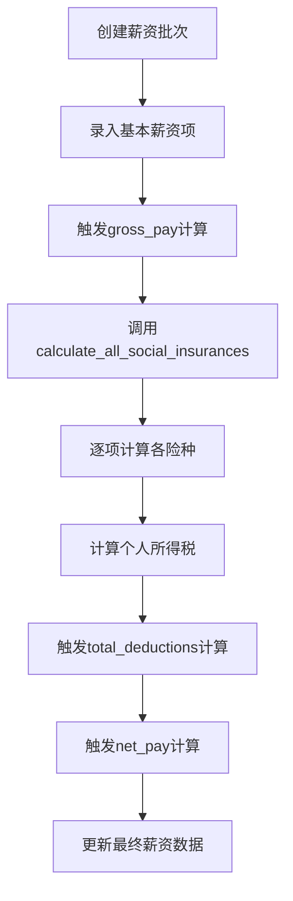
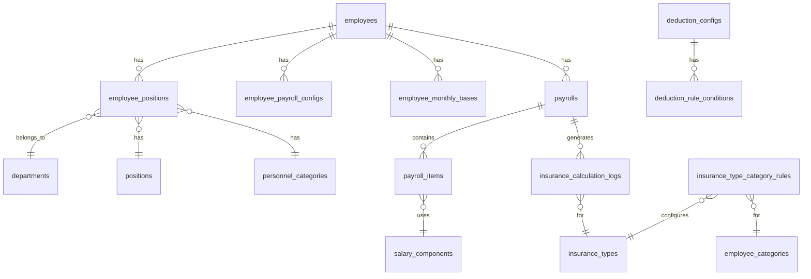

# 薪资计算系统函数逻辑说明文档

## 目录
1. [系统概述](#系统概述)
2. [核心计算流程](#核心计算流程)
3. [社保计算详解](#社保计算详解)
4. [触发器机制](#触发器机制)
5. [批量处理](#批量处理)
6. [数据验证与调整](#数据验证与调整)
7. [数据库表结构](#数据库表结构)
8. [计算示例](#计算示例)
9. [常见问题](#常见问题)

## 系统概述

薪资计算系统基于PostgreSQL数据库函数和触发器实现，提供了完整的薪资计算自动化解决方案。系统支持中国标准的五险一金计算、个人所得税计算，以及各类薪资组成项的灵活配置。

### 技术架构
- **数据库**：PostgreSQL (Supabase)
- **计算引擎**：PL/pgSQL存储过程
- **自动化**：数据库触发器
- **事务保证**：原子性操作

### 核心特性
- ✅ 自动计算五险一金
- ✅ 支持多种人员类别费率
- ✅ 基数上下限自动调整
- ✅ 批量计算与重算
- ✅ 完整的审计日志
- ✅ 事务回滚保护

## 核心计算流程

### 1. 主计算流程图



### 2. 主计算函数：`calculate_all_social_insurances`

```sql
-- 函数签名
calculate_all_social_insurances(
    p_payroll_id UUID,      -- 薪资记录ID
    p_employee_id UUID,     -- 员工ID
    p_effective_date DATE   -- 生效日期
) RETURNS VOID
```

**执行顺序：**
1. 养老保险 (`calculate_pension_insurance`)
2. 医疗保险 (`calculate_medical_insurance`)
3. 失业保险 (`calculate_unemployment_insurance`)
4. 工伤保险 (`calculate_work_injury_insurance`)
5. 生育保险 (`calculate_maternity_insurance`)
6. 住房公积金 (`calculate_housing_fund`)
7. 职业年金 (`calculate_occupational_pension`)
8. 大病保险 (`calculate_serious_illness_insurance`)

## 社保计算详解

### 1. 综合计算函数：`calculate_employee_social_insurance`

#### 1.1 函数签名
```sql
calculate_employee_social_insurance(
    p_employee_id UUID,
    p_period_id UUID,
    p_calculation_date DATE DEFAULT CURRENT_DATE
) RETURNS social_insurance_result
```

#### 1.2 返回类型结构
```sql
TYPE social_insurance_result AS (
    employee_id UUID,
    period_id UUID,
    calculation_date DATE,
    components social_insurance_component[],
    total_employee DECIMAL(12,2),
    total_employer DECIMAL(12,2),
    applied_rules TEXT[],
    unapplied_rules TEXT[],
    calculation_steps JSONB[],
    warnings TEXT[],
    errors TEXT[],
    metadata JSONB
)
```

#### 1.3 计算步骤

##### 步骤1：获取员工信息
```sql
-- 查询员工基本信息、岗位、部门、人员类别
SELECT 
    e.id,
    e.employee_code,
    e.first_name || ' ' || e.last_name as full_name,
    ep.department_id,
    ep.position_id,
    pc.code as personnel_category
FROM employees e
LEFT JOIN employee_positions ep ON e.id = ep.employee_id
LEFT JOIN personnel_categories pc ON ep.personnel_category_id = pc.id
WHERE e.id = p_employee_id
    AND p_calculation_date BETWEEN ep.effective_from 
    AND COALESCE(ep.effective_to, '9999-12-31')
```

##### 步骤2：获取缴费基数
```sql
-- 查询员工缴费基数配置
SELECT 
    epc.base_salary,
    emb.social_insurance_base,
    emb.housing_fund_base,
    emb.occupational_pension_base
FROM employee_payroll_configs epc
LEFT JOIN employee_monthly_bases emb ON epc.employee_id = emb.employee_id
WHERE epc.employee_id = p_employee_id
```

##### 步骤3：遍历扣缴配置
```sql
-- 获取所有适用的扣缴配置
FOR v_applicable_configs IN 
    SELECT 
        dc.*,
        sibc.min_base,
        sibc.max_base,
        -- 评估适用性规则
        CASE WHEN EXISTS(...) THEN true ELSE false END as is_applicable
    FROM deduction_configs dc
    LEFT JOIN social_insurance_base_configs sibc ON ...
    WHERE dc.is_active = true
    ORDER BY dc.priority
LOOP
    -- 逐项计算
END LOOP
```

### 2. 各险种计算函数详解

#### 2.1 养老保险计算
```sql
calculate_pension_insurance(p_payroll_id, p_employee_id, p_effective_date)

计算逻辑：
1. 检查适用性：check_insurance_applicability()
2. 获取缴费基数：get_effective_contribution_base()
3. 获取员工类别：get_closed_employee_category()
4. 查询费率：从insurance_type_category_rules表
5. 计算金额：
   - 个人缴费 = 基数 × 8%
   - 单位缴费 = 基数 × 16%
6. 保存到payroll_items表
7. 记录计算日志
```

#### 2.2 医疗保险计算
```sql
calculate_medical_insurance(p_payroll_id, p_employee_id, p_effective_date)

计算逻辑：
- 个人缴费 = 基数 × 2%
- 单位缴费 = 基数 × 9%
- 使用封闭式查询保证数据一致性
```

#### 2.3 住房公积金计算
```sql
calculate_housing_fund(p_payroll_id, p_employee_id, p_effective_date)

特殊处理：
- 个人缴费 = 基数 × 12%
- 单位缴费 = 基数 × 12%
- 应用特殊进位规则：apply_housing_fund_rounding()
```

### 3. 费率配置表

| 险种 | 个人费率 | 单位费率 | 备注 |
|------|---------|---------|------|
| 养老保险 | 8% | 16% | 基础养老保险 |
| 医疗保险 | 2% | 9% | 含大病保险 |
| 失业保险 | 0.5% | 0.5% | 城镇户口 |
| 工伤保险 | 0% | 0.5% | 单位承担 |
| 生育保险 | 0% | 1% | 单位承担 |
| 住房公积金 | 12% | 12% | 可调整 |

## 触发器机制

### 1. 应发工资触发器

```sql
-- 触发器定义
CREATE TRIGGER gross_pay_trigger_on_insert 
AFTER INSERT ON payroll_items 
FOR EACH ROW 
EXECUTE FUNCTION calculate_gross_pay();

-- 计算函数
CREATE FUNCTION calculate_gross_pay() RETURNS TRIGGER AS $$
BEGIN
    -- 汇总所有收入项
    SELECT COALESCE(SUM(pi.amount), 0)
    INTO v_gross_pay
    FROM payroll_items pi
    JOIN salary_components sc ON pi.component_id = sc.id
    WHERE pi.payroll_id = v_payroll_id
    AND sc.type = 'earning';
    
    -- 更新薪资表
    UPDATE payrolls
    SET gross_pay = v_gross_pay
    WHERE id = v_payroll_id;
    
    RETURN NEW;
END;
$$
```

### 2. 扣款总额触发器

```sql
-- 触发器定义
CREATE TRIGGER total_deductions_trigger_on_insert 
AFTER INSERT ON payroll_items 
FOR EACH ROW 
EXECUTE FUNCTION calculate_total_deductions();

-- 计算逻辑
- 汇总所有type='deduction'的组件
- 更新payrolls.total_deductions
```

### 3. 实发工资触发器

```sql
-- 触发器定义
CREATE TRIGGER net_pay_trigger_on_update 
AFTER UPDATE OF gross_pay, total_deductions ON payrolls 
FOR EACH ROW 
WHEN (OLD.gross_pay IS DISTINCT FROM NEW.gross_pay 
   OR OLD.total_deductions IS DISTINCT FROM NEW.total_deductions)
EXECUTE FUNCTION calculate_net_pay();

-- 计算公式
net_pay = gross_pay - total_deductions
```

## 批量处理

### 1. 批量计算社保

```sql
batch_calculate_social_insurance(
    p_employee_ids UUID[],
    p_period_id UUID,
    p_calculation_date DATE
) RETURNS TABLE(
    employee_id UUID,
    result social_insurance_result,
    status TEXT,
    error_message TEXT
)

特性：
- 异常处理：单个失败不影响其他
- 性能监控：记录处理时间
- 日志记录：详细的执行日志
```

### 2. 批量重算

```sql
batch_recalculate_social_insurances(
    p_pay_period_start DATE,
    p_pay_period_end DATE,
    p_employee_ids UUID[]
)

执行步骤：
1. 清理旧的保险计算记录
2. 删除payroll_items中的保险扣除项
3. 重置total_deductions为0
4. 调用calculate_all_social_insurances重新计算
5. 返回处理结果
```

## 数据验证与调整

### 1. 基数验证函数

```sql
validate_insurance_base(
    p_region TEXT,           -- 地区（如：beijing）
    p_insurance_type TEXT,   -- 险种类型
    p_base DECIMAL,         -- 原始基数
    p_effective_date DATE   -- 生效日期
) RETURNS JSONB

返回示例：
{
    "valid": false,
    "base": 3500.00,
    "adjusted_base": 5000.00,
    "min_base": 5000.00,
    "max_base": 30000.00,
    "reason": "基数低于最低标准，已调整至最低基数"
}
```

### 2. 基数调整规则

```sql
adjust_insurance_base(
    p_original_base NUMERIC,
    p_min_base NUMERIC,
    p_max_base NUMERIC,
    p_insurance_type TEXT
) RETURNS JSONB

调整逻辑：
IF p_original_base < p_min_base THEN
    v_adjusted_base := p_min_base
ELSIF p_original_base > p_max_base THEN
    v_adjusted_base := p_max_base
ELSE
    v_adjusted_base := p_original_base
END IF

-- 四舍五入取整
v_adjusted_base := ROUND(v_adjusted_base, 0)
```

### 3. 基数限制配置（2024年北京标准）

| 险种 | 最低基数 | 最高基数 |
|------|---------|---------|
| 养老保险 | 6326 | 33891 |
| 医疗保险 | 6326 | 33891 |
| 失业保险 | 6326 | 33891 |
| 工伤保险 | 6326 | 33891 |
| 生育保险 | 6326 | 33891 |
| 住房公积金 | 2420 | 33891 |

## 数据库表结构

### 1. 核心表关系图



### 2. 主要表说明

#### payrolls - 薪资主表
```sql
CREATE TABLE payrolls (
    id UUID PRIMARY KEY,
    employee_id UUID REFERENCES employees(id),
    pay_period_start DATE,
    pay_period_end DATE,
    pay_date DATE,
    gross_pay NUMERIC(10,2),      -- 应发工资
    total_deductions NUMERIC(10,2), -- 扣款总额
    net_pay NUMERIC(10,2),         -- 实发工资
    status payroll_status,         -- 状态
    notes TEXT,
    created_at TIMESTAMP,
    updated_at TIMESTAMP
);
```

#### payroll_items - 薪资项目明细
```sql
CREATE TABLE payroll_items (
    id UUID PRIMARY KEY,
    payroll_id UUID REFERENCES payrolls(id),
    component_id UUID REFERENCES salary_components(id),
    amount NUMERIC(10,2),
    notes TEXT,
    created_at TIMESTAMP,
    UNIQUE(payroll_id, component_id)  -- 防止重复
);
```

#### salary_components - 薪资组件配置
```sql
CREATE TABLE salary_components (
    id UUID PRIMARY KEY,
    name TEXT,
    type TEXT CHECK (type IN ('earning', 'deduction')),
    category TEXT,
    is_taxable BOOLEAN,
    is_social_insurance BOOLEAN,
    calculation_method TEXT,
    display_order INTEGER
);
```

#### insurance_calculation_logs - 保险计算日志
```sql
CREATE TABLE insurance_calculation_logs (
    id UUID PRIMARY KEY,
    payroll_id UUID,
    employee_id UUID,
    insurance_type_id UUID,
    calculation_date TIMESTAMP,
    base_amount NUMERIC(10,2),
    employee_rate NUMERIC(5,4),
    employer_rate NUMERIC(5,4),
    employee_amount NUMERIC(10,2),
    employer_amount NUMERIC(10,2),
    is_applicable BOOLEAN,
    skip_reason TEXT,
    metadata JSONB
);
```

## 计算示例

### 示例1：标准员工薪资计算

```sql
-- 员工基本信息
员工：张三
基本工资：15000元
岗位工资：3000元
绩效奖金：2000元
餐补：500元

-- 计算过程
1. 应发工资 = 15000 + 3000 + 2000 + 500 = 20500元

2. 社保计算（基数15000）
   养老保险（个人）= 15000 × 8% = 1200元
   医疗保险（个人）= 15000 × 2% = 300元
   失业保险（个人）= 15000 × 0.5% = 75元
   住房公积金（个人）= 15000 × 12% = 1800元
   社保扣款合计 = 3375元

3. 个税计算
   应纳税所得额 = 20500 - 3375 - 5000 = 12125元
   个税 = 12125 × 10% - 210 = 1002.5元

4. 实发工资 = 20500 - 3375 - 1002.5 = 16122.5元
```

### 示例2：批量计算调用

```sql
-- 调用批量计算
SELECT * FROM batch_calculate_social_insurance(
    ARRAY['emp001', 'emp002', 'emp003']::UUID[],
    'period_202402'::UUID,
    '2024-02-01'::DATE
);

-- 返回结果
employee_id | status  | error_message
------------|---------|---------------
emp001      | success | NULL
emp002      | success | NULL
emp003      | error   | 缺少缴费基数配置
```

## 常见问题

### Q1: 如何处理特殊人员的保险计算？

**答**：系统通过`personnel_categories`和`insurance_type_category_rules`表配置不同人员类别的费率规则。例如：
- 退休返聘人员：不缴纳养老保险
- 实习生：可能不缴纳某些险种
- 外籍员工：特殊的缴费规则

### Q2: 如何处理补缴和调整？

**答**：使用批量重算功能：
```sql
SELECT * FROM batch_recalculate_social_insurances(
    '2024-01-01'::DATE,  -- 开始日期
    '2024-01-31'::DATE,  -- 结束日期
    NULL                  -- 所有员工
);
```

### Q3: 如何确保计算的事务一致性？

**答**：系统采用以下机制：
1. 所有计算在事务内执行
2. 使用`atomic_migrate_*`函数确保原子性
3. 错误率超过5%自动回滚
4. 完整的审计日志

### Q4: 如何优化大批量计算性能？

**建议**：
1. 分批处理（每批100-500人）
2. 在非高峰时段执行
3. 使用异步任务队列
4. 定期维护数据库索引

### Q5: 如何处理跨月或跨年的薪资？

**答**：系统通过`pay_period_start`和`pay_period_end`字段精确控制薪资期间，支持：
- 自然月薪资（1日-月末）
- 自定义期间（如26日-次月25日）
- 跨年度处理

## 维护建议

1. **定期备份**：每日备份薪资数据和计算日志
2. **监控告警**：设置计算失败率告警
3. **版本控制**：所有函数变更需要版本记录
4. **性能优化**：定期分析慢查询并优化
5. **合规更新**：及时更新费率和基数限制

## 联系支持

如有问题或需要技术支持，请联系：
- 系统管理员
- 数据库管理员
- HR系统技术支持团队

---

*文档版本：v2.0*  
*最后更新：2024-12-28*  
*适用系统：高新区工资信息管理系统 V3*