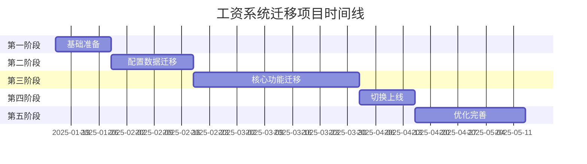

# 工资管理系统数据库迁移任务计划

**文档版本**: 1.0  
**创建日期**: 2025-01-08  
**项目负责人**: _______________  
**预计工期**: 17周  

## 项目概述

本文档定义了从现有PostgreSQL架构迁移到Supabase优化架构的详细任务计划。项目采用敏捷开发方法，分5个阶段实施，确保业务连续性和数据完整性。

## 里程碑时间线

## 详细任务分解

### 第一阶段：基础准备（2周）

#### Sprint 1: 环境搭建与团队准备（第1周）

| 任务ID | 任务名称 | 负责人 | 工时 | 前置任务 | 交付物 | 完成标准 |
|--------|----------|--------|------|----------|---------|----------|
| 1.1.1 | Supabase项目初始化 | DevOps | 8h | - | Supabase项目实例 | 项目创建成功，权限配置完成 |
| 1.1.2 | 开发环境配置 | DevOps | 16h | 1.1.1 | 开发环境文档 | 所有开发人员可正常访问 |
| 1.1.3 | CI/CD管道搭建 | DevOps | 24h | 1.1.2 | Jenkins/GitHub Actions配置 | 自动化部署流程可用 |
| 1.1.4 | 监控系统部署 | DevOps | 16h | 1.1.1 | Grafana仪表板 | 关键指标监控就绪 |
| 1.1.5 | 团队培训计划制定 | Tech Lead | 8h | - | 培训大纲和材料 | 培训计划获批准 |
| 1.1.6 | Supabase基础培训 | Tech Lead | 16h | 1.1.5 | 培训记录 | 团队成员通过测试 |

#### Sprint 2: 技术方案细化（第2周）

| 任务ID | 任务名称 | 负责人 | 工时 | 前置任务 | 交付物 | 完成标准 |
|--------|----------|--------|------|----------|---------|----------|
| 1.2.1 | 数据模型详细设计 | 架构师 | 24h | - | ERD图和DDL脚本 | 设计评审通过 |
| 1.2.2 | 迁移工具选型评估 | 高级开发 | 16h | - | 工具对比报告 | 工具确定并测试通过 |
| 1.2.3 | 性能基准测试方案 | 测试工程师 | 16h | - | 测试方案文档 | 方案评审通过 |
| 1.2.4 | 数据映射规则定义 | 数据分析师 | 24h | 1.2.1 | 映射规则文档 | 规则验证完成 |
| 1.2.5 | 回滚方案设计 | 架构师 | 16h | 1.2.1 | 回滚流程文档 | 方案演练成功 |
| 1.2.6 | 风险评估更新 | 项目经理 | 8h | All | 风险登记表 | 风险应对措施确定 |

### 第二阶段：配置数据迁移（3周）

#### Sprint 3: 静态数据迁移（第3周）

| 任务ID | 任务名称 | 负责人 | 工时 | 前置任务 | 交付物 | 完成标准 |
|--------|----------|--------|------|----------|---------|----------|
| 2.1.1 | 创建目标Schema | DBA | 16h | 1.2.1 | 数据库Schema | 所有表创建成功 |
| 2.1.2 | 编写数据迁移脚本 | 高级开发 | 32h | 2.1.1 | Python/SQL脚本 | 脚本测试通过 |
| 2.1.3 | 迁移社保费率配置 | 开发人员A | 16h | 2.1.2 | 迁移日志 | 数据验证100%匹配 |
| 2.1.4 | 迁移税率配置 | 开发人员B | 16h | 2.1.2 | 迁移日志 | 数据验证100%匹配 |
| 2.1.5 | 迁移组件定义 | 开发人员C | 24h | 2.1.2 | 迁移日志 | 数据验证100%匹配 |
| 2.1.6 | 配置数据验证 | 测试工程师 | 16h | 2.1.3-5 | 测试报告 | 所有测试用例通过 |

#### Sprint 4: 员工数据迁移（第4周）

| 任务ID | 任务名称 | 负责人 | 工时 | 前置任务 | 交付物 | 完成标准 |
|--------|----------|--------|------|----------|---------|----------|
| 2.2.1 | 员工基础信息迁移 | 开发人员A | 24h | 2.1.6 | 迁移日志 | 数据完整性验证通过 |
| 2.2.2 | 部门职位数据迁移 | 开发人员B | 16h | 2.1.6 | 迁移日志 | 组织架构验证正确 |
| 2.2.3 | 薪资配置迁移 | 开发人员C | 32h | 2.2.1 | 迁移日志 | 配置验证无误 |
| 2.2.4 | 历史数据处理策略 | 数据分析师 | 16h | - | 处理方案文档 | 方案评审通过 |
| 2.2.5 | 数据质量检查 | 测试工程师 | 24h | 2.2.1-3 | 质量报告 | 数据质量达标 |
| 2.2.6 | 性能测试 | 测试工程师 | 16h | 2.2.5 | 性能报告 | 满足性能指标 |

#### Sprint 5: 迁移验证与优化（第5周）

| 任务ID | 任务名称 | 负责人 | 工时 | 前置任务 | 交付物 | 完成标准 |
|--------|----------|--------|------|----------|---------|----------|
| 2.3.1 | 端到端数据验证 | 测试团队 | 32h | 2.2.6 | 验证报告 | 数据一致性99.9% |
| 2.3.2 | 索引优化 | DBA | 16h | 2.3.1 | 优化报告 | 查询性能达标 |
| 2.3.3 | 批量迁移工具优化 | 高级开发 | 24h | 2.3.1 | 优化版工具 | 迁移速度提升50% |
| 2.3.4 | 文档更新 | 技术写手 | 16h | All | 更新的文档 | 文档评审通过 |
| 2.3.5 | 第二阶段总结 | 项目经理 | 8h | All | 阶段报告 | 管理层批准 |

### 第三阶段：核心功能迁移（6周）

#### Sprint 6-7: 计算引擎开发（第6-7周）

| 任务ID | 任务名称 | 负责人 | 工时 | 前置任务 | 交付物 | 完成标准 |
|--------|----------|--------|------|----------|---------|----------|
| 3.1.1 | 工资计算主函数开发 | 高级开发A | 40h | - | PL/pgSQL函数 | 单元测试通过 |
| 3.1.2 | 五险一金计算函数 | 高级开发B | 32h | - | PL/pgSQL函数 | 计算准确率100% |
| 3.1.3 | 个税计算函数 | 高级开发C | 32h | - | PL/pgSQL函数 | 符合最新税法 |
| 3.1.4 | 规则引擎实现 | 高级开发D | 40h | - | 规则引擎模块 | 规则执行正确 |
| 3.1.5 | 计算性能优化 | DBA | 24h | 3.1.1-4 | 优化报告 | 性能提升50% |
| 3.1.6 | 集成测试 | 测试团队 | 40h | 3.1.5 | 测试报告 | 覆盖率>90% |

#### Sprint 8-9: 历史数据迁移（第8-9周）

| 任务ID | 任务名称 | 负责人 | 工时 | 前置任务 | 交付物 | 完成标准 |
|--------|----------|--------|------|----------|---------|----------|
| 3.2.1 | 2024年数据迁移 | 数据团队 | 48h | 3.1.6 | 迁移报告 | 数据验证通过 |
| 3.2.2 | 2023年数据迁移 | 数据团队 | 48h | 3.2.1 | 迁移报告 | 数据验证通过 |
| 3.2.3 | 历史数据归档策略 | 架构师 | 16h | - | 归档方案 | 方案实施成功 |
| 3.2.4 | 数据一致性校验 | 测试团队 | 32h | 3.2.1-2 | 校验报告 | 一致性100% |
| 3.2.5 | 性能压力测试 | 测试团队 | 24h | 3.2.4 | 压测报告 | 满足生产要求 |

#### Sprint 10-11: API与集成（第10-11周）

| 任务ID | 任务名称 | 负责人 | 工时 | 前置任务 | 交付物 | 完成标准 |
|--------|----------|--------|------|----------|---------|----------|
| 3.3.1 | RESTful API开发 | 后端团队 | 64h | - | API文档和代码 | API测试通过 |
| 3.3.2 | GraphQL接口开发 | 后端团队 | 40h | - | GraphQL Schema | 查询测试通过 |
| 3.3.3 | 认证授权集成 | 安全工程师 | 32h | 3.3.1 | 安全配置 | 安全测试通过 |
| 3.3.4 | 前端集成适配 | 前端团队 | 48h | 3.3.1-2 | 适配代码 | 功能正常 |
| 3.3.5 | 第三方系统集成 | 集成工程师 | 40h | 3.3.1 | 集成适配器 | 集成测试通过 |

### 第四阶段：切换上线（2周）

#### Sprint 12: 灰度发布（第12周）

| 任务ID | 任务名称 | 负责人 | 工时 | 前置任务 | 交付物 | 完成标准 |
|--------|----------|--------|------|----------|---------|----------|
| 4.1.1 | 灰度发布计划制定 | 项目经理 | 8h | - | 发布计划 | 计划批准 |
| 4.1.2 | 灰度环境部署 | DevOps | 16h | 4.1.1 | 灰度环境 | 环境就绪 |
| 4.1.3 | 5%用户灰度 | 运维团队 | 8h | 4.1.2 | 监控报告 | 无重大问题 |
| 4.1.4 | 20%用户灰度 | 运维团队 | 8h | 4.1.3 | 监控报告 | 性能稳定 |
| 4.1.5 | 问题收集与修复 | 开发团队 | 32h | 4.1.3-4 | 修复日志 | 问题解决 |
| 4.1.6 | 用户培训 | 培训团队 | 16h | - | 培训材料 | 用户反馈良好 |

#### Sprint 13: 全量切换（第13周）

| 任务ID | 任务名称 | 负责人 | 工时 | 前置任务 | 交付物 | 完成标准 |
|--------|----------|--------|------|----------|---------|----------|
| 4.2.1 | 切换前检查清单 | 全体团队 | 16h | 4.1.6 | 检查报告 | 所有项通过 |
| 4.2.2 | 数据同步验证 | 数据团队 | 16h | 4.2.1 | 验证报告 | 数据一致 |
| 4.2.3 | 全量切换执行 | 运维团队 | 8h | 4.2.2 | 切换日志 | 切换成功 |
| 4.2.4 | 生产监控 | 运维团队 | 24h | 4.2.3 | 监控报告 | 系统稳定 |
| 4.2.5 | 应急响应待命 | 全体团队 | 40h | 4.2.3 | 值班日志 | 及时响应 |
| 4.2.6 | 切换总结报告 | 项目经理 | 8h | 4.2.5 | 总结报告 | 管理层认可 |

### 第五阶段：优化完善（4周）

#### Sprint 14-15: 性能优化（第14-15周）

| 任务ID | 任务名称 | 负责人 | 工时 | 前置任务 | 交付物 | 完成标准 |
|--------|----------|--------|------|----------|---------|----------|
| 5.1.1 | 性能瓶颈分析 | 性能工程师 | 24h | - | 分析报告 | 瓶颈识别完成 |
| 5.1.2 | 查询优化 | DBA | 32h | 5.1.1 | 优化脚本 | 查询速度提升 |
| 5.1.3 | 缓存策略实施 | 高级开发 | 32h | 5.1.1 | 缓存配置 | 命中率>80% |
| 5.1.4 | 数据库参数调优 | DBA | 16h | 5.1.1 | 参数配置 | 性能提升20% |
| 5.1.5 | 负载均衡优化 | DevOps | 24h | - | 配置更新 | 负载均衡 |
| 5.1.6 | 性能测试验证 | 测试团队 | 32h | 5.1.2-5 | 测试报告 | 达到目标值 |

#### Sprint 16-17: 功能完善与收尾（第16-17周）

| 任务ID | 任务名称 | 负责人 | 工时 | 前置任务 | 交付物 | 完成标准 |
|--------|----------|--------|------|----------|---------|----------|
| 5.2.1 | 用户反馈收集 | 产品经理 | 16h | - | 反馈报告 | 反馈整理完成 |
| 5.2.2 | 功能优化实施 | 开发团队 | 48h | 5.2.1 | 优化版本 | 用户满意度提升 |
| 5.2.3 | 文档完善 | 技术写手 | 32h | All | 完整文档 | 文档体系完整 |
| 5.2.4 | 知识转移 | 全体团队 | 24h | 5.2.3 | 培训记录 | 运维团队掌握 |
| 5.2.5 | 旧系统下线 | 运维团队 | 16h | 5.2.4 | 下线报告 | 安全下线 |
| 5.2.6 | 项目总结 | 项目经理 | 16h | All | 项目总结报告 | 经验总结完成 |

## 资源计划

### 人力资源需求

| 角色 | 人数 | 投入度 | 关键技能 |
|------|------|---------|----------|
| 项目经理 | 1 | 100% | 项目管理、风险控制 |
| 技术架构师 | 1 | 80% | 系统设计、Supabase |
| 数据库管理员 | 2 | 100% | PostgreSQL、性能优化 |
| 高级开发工程师 | 4 | 100% | PL/pgSQL、Node.js |
| 前端工程师 | 2 | 60% | React、TypeScript |
| 测试工程师 | 3 | 100% | 自动化测试、性能测试 |
| DevOps工程师 | 2 | 80% | CI/CD、监控 |
| 数据分析师 | 1 | 60% | 数据迁移、验证 |

### 基础设施需求

| 资源类型 | 规格 | 数量 | 用途 |
|----------|------|------|------|
| Supabase Pro | - | 3 | 开发、测试、生产 |
| 云服务器 | 8C16G | 4 | 应用服务器 |
| 负载均衡 | - | 2 | 流量分发 |
| 监控服务 | - | 1 | 系统监控 |
| 备份存储 | 2TB | 1 | 数据备份 |

## 风险管理

### 风险登记表

| 风险ID | 风险描述 | 影响 | 概率 | 应对措施 | 负责人 |
|--------|----------|------|------|----------|--------|
| R001 | 数据迁移过程中数据丢失 | 高 | 中 | 多重备份、验证机制 | DBA |
| R002 | 新系统性能不达预期 | 高 | 低 | 早期性能测试、优化预留 | 架构师 |
| R003 | 业务逻辑理解偏差 | 中 | 中 | 充分的业务分析、用户确认 | 产品经理 |
| R004 | 团队技能不足 | 中 | 中 | 培训计划、外部支持 | 项目经理 |
| R005 | 第三方集成问题 | 中 | 低 | 提前沟通、接口测试 | 集成工程师 |
| R006 | 用户接受度低 | 中 | 中 | 用户培训、渐进式推广 | 产品经理 |

### 风险应对计划

1. **数据安全保障**
   - 实施三重备份策略
   - 每次迁移前后进行数据校验
   - 保留30天回滚能力

2. **性能保障**
   - 设立性能基线
   - 持续监控关键指标
   - 预留优化时间窗口

3. **业务连续性**
   - 采用灰度发布策略
   - 建立快速回滚机制
   - 7×24小时应急响应

## 沟通计划

### 定期会议安排

| 会议类型 | 频率 | 参与者 | 时长 | 目的 |
|----------|------|--------|------|------|
| 每日站会 | 每天 | 开发团队 | 15分钟 | 进度同步、问题解决 |
| 周进度会 | 每周 | 全体成员 | 1小时 | 周进度回顾、计划调整 |
| 阶段评审 | 每阶段 | 管理层+核心团队 | 2小时 | 阶段成果评审、决策 |
| 风险评估会 | 双周 | 项目经理+关键角色 | 1小时 | 风险识别和应对 |

### 汇报机制

1. **周报**：每周五发送项目周报
2. **里程碑报告**：每个阶段结束时提交
3. **紧急事件**：1小时内上报
4. **指标仪表板**：实时更新关键指标

## 质量保证

### 测试策略

| 测试类型 | 覆盖范围 | 通过标准 | 负责团队 |
|----------|----------|----------|----------|
| 单元测试 | 核心函数 | 覆盖率>90% | 开发团队 |
| 集成测试 | API接口 | 全部通过 | 测试团队 |
| 性能测试 | 关键流程 | 满足SLA | 性能团队 |
| 安全测试 | 全系统 | 无高危漏洞 | 安全团队 |
| 用户验收测试 | 业务流程 | 用户签字确认 | 业务团队 |

### 质量指标

- **代码质量**：代码审查覆盖率100%
- **缺陷密度**：<5个/千行代码
- **测试覆盖率**：>85%
- **性能达标率**：>95%
- **可用性**：>99.9%

## 变更管理

### 变更控制流程

1. **变更请求**：通过统一模板提交
2. **影响评估**：技术和业务双重评估
3. **审批流程**：根据影响级别确定审批层级
4. **实施跟踪**：变更实施全程跟踪
5. **验证关闭**：确认变更效果后关闭

### 变更分类

| 类别 | 影响范围 | 审批级别 | 处理时限 |
|------|----------|----------|----------|
| 紧急 | 影响生产 | 项目经理 | 4小时 |
| 重要 | 影响进度 | 技术经理 | 1天 |
| 一般 | 功能优化 | 模块负责人 | 3天 |
| 建议 | 体验改善 | 下版本考虑 | - |

## 培训计划

### 技术培训

| 培训主题 | 目标人群 | 时长 | 时间安排 |
|----------|----------|------|----------|
| Supabase基础 | 全体技术人员 | 2天 | 第1周 |
| PostgreSQL高级特性 | DBA和高级开发 | 3天 | 第2周 |
| 新系统架构 | 全体技术人员 | 1天 | 第3周 |
| 运维操作指南 | 运维团队 | 2天 | 第15周 |

### 业务培训

| 培训主题 | 目标人群 | 时长 | 时间安排 |
|----------|----------|------|----------|
| 系统功能介绍 | 业务用户 | 0.5天 | 第12周 |
| 操作流程培训 | 关键用户 | 1天 | 第13周 |
| 常见问题处理 | 支持团队 | 1天 | 第16周 |

## 成功标准

### 项目成功标准

1. **按时交付**：在计划时间内完成所有迁移
2. **质量达标**：无重大生产事故
3. **性能提升**：查询性能提升50%以上
4. **用户满意**：满意度调查>85分
5. **知识转移**：运维团队独立维护

### 关键绩效指标（KPI）

| 指标 | 目标值 | 测量方法 |
|------|--------|----------|
| 数据准确性 | 99.99% | 自动化验证 |
| 系统可用性 | 99.9% | 监控工具 |
| 平均响应时间 | <200ms | APM工具 |
| 缺陷修复时间 | <24小时 | 缺陷跟踪系统 |
| 用户采用率 | >95% | 使用统计 |

## 项目收尾

### 收尾活动清单

- [ ] 所有功能测试通过
- [ ] 性能指标达到要求
- [ ] 文档更新完成
- [ ] 知识转移完成
- [ ] 用户培训完成
- [ ] 旧系统安全下线
- [ ] 数据归档完成
- [ ] 项目总结报告
- [ ] 经验教训总结
- [ ] 团队表彰会

### 交付物清单

1. **技术文档**
   - 系统架构文档
   - 数据库设计文档
   - API接口文档
   - 运维手册

2. **管理文档**
   - 项目总结报告
   - 风险管理报告
   - 质量保证报告
   - 培训材料

3. **系统交付**
   - 生产环境系统
   - 监控配置
   - 备份策略
   - 应急预案

## 附录

### A. 联系人列表

| 角色 | 姓名 | 联系方式 | 备注 |
|------|------|----------|------|
| 项目发起人 | - | - | 高层决策 |
| 项目经理 | - | - | 整体协调 |
| 技术负责人 | - | - | 技术决策 |
| 业务负责人 | - | - | 业务确认 |

### B. 工具和模板

- 项目管理工具：Jira/Trello
- 代码管理：Git/GitHub
- CI/CD工具：Jenkins/GitHub Actions
- 监控工具：Grafana/Prometheus
- 文档工具：Confluence/Notion

### C. 参考资料

- Supabase官方文档
- PostgreSQL迁移最佳实践
- 项目管理知识体系指南（PMBOK）

---

**文档审批**  
编制: _______________  日期: _______________  
审核: _______________  日期: _______________  
批准: _______________  日期: _______________