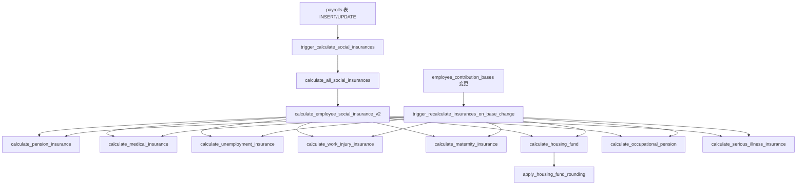
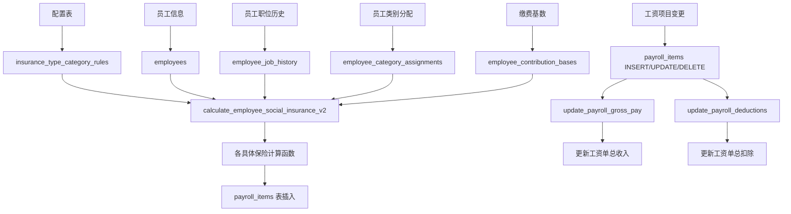
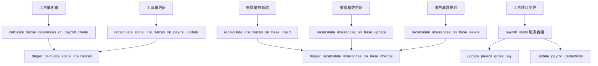
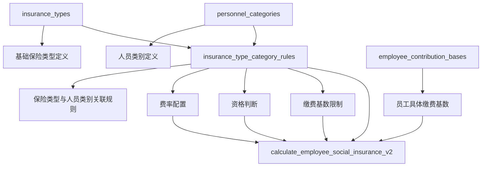

# 薪资系统触发器和函数详细说明文档

## 概述

本文档详细描述了薪资管理系统中所有与工资计算相关的数据库触发器和函数，包括它们的功能、参数、返回值以及相互之间的关联性。

## 触发器列表

### 1. 工资计算触发器

#### 1.1 `calculate_social_insurances_on_payroll_create`
- **表**: `payrolls`
- **事件**: `INSERT` (AFTER)
- **功能**: 当创建新工资单时自动计算社会保险
- **调用函数**: `trigger_calculate_social_insurances()`

#### 1.2 `recalculate_social_insurances_on_payroll_update`
- **表**: `payrolls`
- **事件**: `UPDATE` (AFTER)
- **功能**: 当工资单更新时重新计算社会保险
- **调用函数**: `trigger_calculate_social_insurances()`

### 2. 缴费基数变更触发器

#### 2.1 `recalculate_insurances_on_base_insert`
- **表**: `employee_contribution_bases`
- **事件**: `INSERT` (AFTER)
- **功能**: 当新增员工缴费基数时重新计算相关保险
- **调用函数**: `trigger_recalculate_insurances_on_base_change()`

#### 2.2 `recalculate_insurances_on_base_update`
- **表**: `employee_contribution_bases`
- **事件**: `UPDATE` (AFTER)
- **功能**: 当更新员工缴费基数时重新计算相关保险
- **调用函数**: `trigger_recalculate_insurances_on_base_change()`

#### 2.3 `recalculate_insurances_on_base_delete`
- **表**: `employee_contribution_bases`
- **事件**: `DELETE` (AFTER)
- **功能**: 当删除员工缴费基数时重新计算相关保险
- **调用函数**: `trigger_recalculate_insurances_on_base_change()`

### 3. 工资项目变更触发器

#### 3.1 工资收入项目触发器
- `update_payroll_earnings_on_insert` - INSERT 时更新总收入
- `update_payroll_earnings_on_update` - UPDATE 时更新总收入
- `update_payroll_earnings_on_delete` - DELETE 时更新总收入
- **调用函数**: `update_payroll_gross_pay()`

#### 3.2 工资扣除项目触发器
- `update_payroll_deductions_on_insert` - INSERT 时更新总扣除
- `update_payroll_deductions_on_update` - UPDATE 时更新总扣除
- `update_payroll_deductions_on_delete` - DELETE 时更新总扣除
- **调用函数**: `update_payroll_deductions()`

### 4. 通知触发器

#### 4.1 `payroll_paid_trigger`
- **表**: `payrolls`
- **事件**: `UPDATE` (AFTER)
- **功能**: 工资发放时通知员工
- **调用函数**: `notify_employee_on_payroll_paid()`

### 5. 时间戳更新触发器

#### 5.1 `update_insurance_type_category_rules_updated_at`
- **表**: `insurance_type_category_rules`
- **事件**: `UPDATE` (BEFORE)
- **功能**: 自动更新修改时间
- **调用函数**: `update_updated_at_column()`

## 核心函数详细说明

### 1. 主要计算函数

#### 1.1 `calculate_all_social_insurances`
- **功能**: 为指定员工和工资单计算所有社会保险
- **参数**: 
  - `p_payroll_id` (UUID): 工资单ID
  - `p_employee_id` (UUID): 员工ID
  - `p_effective_date` (DATE): 计算日期
- **返回**: void
- **说明**: 这是主要的社会保险计算入口函数

#### 1.2 `calculate_employee_social_insurance_v2`
- **功能**: 最新版本的员工社会保险计算函数，支持动态函数调用
- **参数**:
  - `p_employee_id` (UUID): 员工ID
  - `p_period_id` (UUID): 期间ID
  - `p_calculation_date` (DATE): 计算日期
- **返回**: `social_insurance_result`
- **特点**: 
  - 使用配置表驱动计算
  - 动态调用具体保险计算函数
  - 支持员工类别判断

#### 1.3 `calculate_monthly_insurance_with_eligibility`
- **功能**: 基于员工资格的月度保险计算
- **参数**:
  - `p_employee_id` (UUID): 员工ID
  - `p_period_date` (DATE): 期间日期
- **返回**: 表格格式结果
- **特点**: 简化版计算，主要用于资格检查

### 2. 具体保险计算函数

#### 2.1 `calculate_pension_insurance`
- **功能**: 计算养老保险
- **调用者**: `calculate_employee_social_insurance_v2`

#### 2.2 `calculate_medical_insurance`
- **功能**: 计算医疗保险
- **调用者**: `calculate_employee_social_insurance_v2`

#### 2.3 `calculate_unemployment_insurance`
- **功能**: 计算失业保险
- **调用者**: `calculate_employee_social_insurance_v2`

#### 2.4 `calculate_work_injury_insurance`
- **功能**: 计算工伤保险
- **调用者**: `calculate_employee_social_insurance_v2`

#### 2.5 `calculate_maternity_insurance`
- **功能**: 计算生育保险
- **调用者**: `calculate_employee_social_insurance_v2`

#### 2.6 `calculate_housing_fund`
- **功能**: 计算住房公积金
- **调用者**: `calculate_employee_social_insurance_v2`
- **特殊功能**: 使用 `apply_housing_fund_rounding` 进行特殊舍入

#### 2.7 `calculate_occupational_pension`
- **功能**: 计算职业年金
- **调用者**: `calculate_employee_social_insurance_v2`

#### 2.8 `calculate_serious_illness_insurance`
- **功能**: 计算大病保险
- **调用者**: `calculate_employee_social_insurance_v2`

### 3. 辅助和工具函数

#### 3.1 `apply_housing_fund_rounding`
- **功能**: 住房公积金特殊舍入规则（0.1阈值）
- **参数**: `p_amount` (NUMERIC)
- **返回**: NUMERIC

#### 3.2 `check_insurance_eligibility`
- **功能**: 检查员工是否符合特定保险的参保条件
- **参数**: 员工ID、保险类型ID、生效日期
- **返回**: BOOLEAN

#### 3.3 `get_employee_eligible_insurance_types`
- **功能**: 获取员工符合条件的所有保险类型
- **返回**: 表格格式结果

#### 3.4 `adjust_insurance_base`
- **功能**: 根据最低、最高缴费基数调整实际缴费基数
- **返回**: JSONB格式结果

### 4. 批量处理函数

#### 4.1 `batch_calculate_social_insurance`
- **功能**: 批量计算多个员工的社会保险
- **参数**: 员工ID数组、期间ID、计算日期
- **返回**: 表格格式的批量结果

#### 4.2 `batch_recalculate_social_insurances`
- **功能**: 批量重新计算指定期间的社会保险
- **参数**: 期间开始日期、结束日期、员工ID数组（可选）

### 5. 管理和维护函数

#### 5.1 `disable_social_insurance_triggers` / `enable_social_insurance_triggers`
- **功能**: 禁用/启用社会保险相关触发器
- **用途**: 批量数据操作时避免触发器干扰

#### 5.2 `transform_social_insurance_configs`
- **功能**: 社会保险配置数据转换
- **参数**: `p_dry_run` (BOOLEAN) - 是否为演习模式

#### 5.3 `execute_social_insurance_migration`
- **功能**: 执行社会保险数据迁移
- **参数**: 源连接字符串、批次大小、演习模式标志

## 函数关联性图表

### 主要计算流程图

### 数据流和依赖关系图

### 触发器激活流程图

### 函数类别分组图

```mermaid
graph TD
    A[薪资系统函数] --> B[计算类函数]
    A --> C[触发器函数]
    A --> D[工具类函数]
    A --> E[批量处理函数]
    A --> F[管理维护函数]
    
    B --> B1[calculate_employee_social_insurance_v2]
    B --> B2[calculate_all_social_insurances]
    B --> B3[各具体保险计算函数]
    
    C --> C1[trigger_calculate_social_insurances]
    C --> C2[trigger_recalculate_insurances_on_base_change]
    C --> C3[update_payroll_gross_pay]
    C --> C4[update_payroll_deductions]
    
    D --> D1[apply_housing_fund_rounding]
    D --> D2[check_insurance_eligibility]
    D --> D3[adjust_insurance_base]
    D --> D4[get_employee_eligible_insurance_types]
    
    E --> E1[batch_calculate_social_insurance]
    E --> E2[batch_recalculate_social_insurances]
    
    F --> F1[disable_social_insurance_triggers]
    F --> F2[enable_social_insurance_triggers]
    F --> F3[transform_social_insurance_configs]
    F --> F4[execute_social_insurance_migration]
```

## 关键配置表关系

### 保险类型配置体系

## 数据处理特性

### 1. 动态函数调用机制
`calculate_employee_social_insurance_v2` 使用 PostgreSQL 的 `EXECUTE format()` 动态调用具体的保险计算函数，实现了高度灵活的计算架构。

### 2. 配置驱动计算
通过 `insurance_type_category_rules` 表实现配置驱动的费率和资格管理，避免硬编码。

### 3. 特殊舍入规则
住房公积金采用特殊的舍入规则（0.1阈值），通过专门的 `apply_housing_fund_rounding` 函数实现。

### 4. 自动重算机制
当缴费基数发生变更时，系统自动重新计算近3个月内未定案的工资单，确保数据一致性。

### 5. 批量处理能力
提供批量计算和重算功能，支持大规模数据处理，同时提供触发器开关机制避免性能问题。

## 使用建议

1. **新增保险类型**: 需要在 `insurance_types` 表添加记录，并在 `insurance_type_category_rules` 表配置规则
2. **修改费率**: 通过更新 `insurance_type_category_rules` 表实现，系统会自动应用新费率
3. **批量重算**: 使用 `batch_recalculate_social_insurances` 函数，必要时可临时禁用触发器提升性能
4. **数据迁移**: 使用 `execute_social_insurance_migration` 和相关转换函数
5. **调试和测试**: 使用 `test_social_insurance_calculation` 函数进行单员工测试

## 维护注意事项

1. **函数依赖关系**: `calculate_employee_social_insurance_v2` 依赖所有具体保险计算函数，删除时需谨慎
2. **触发器管理**: 批量操作前建议禁用触发器，操作完成后重新启用
3. **配置表更新**: 修改 `insurance_type_category_rules` 会触发相关工资单重算
4. **性能监控**: 大量工资单的重算可能影响性能，建议在业务低峰期进行
5. **数据一致性**: 缴费基数变更会自动触发重算，确保数据一致性

本文档涵盖了薪资系统中所有主要的触发器和函数，为系统维护和开发提供了全面的技术参考。