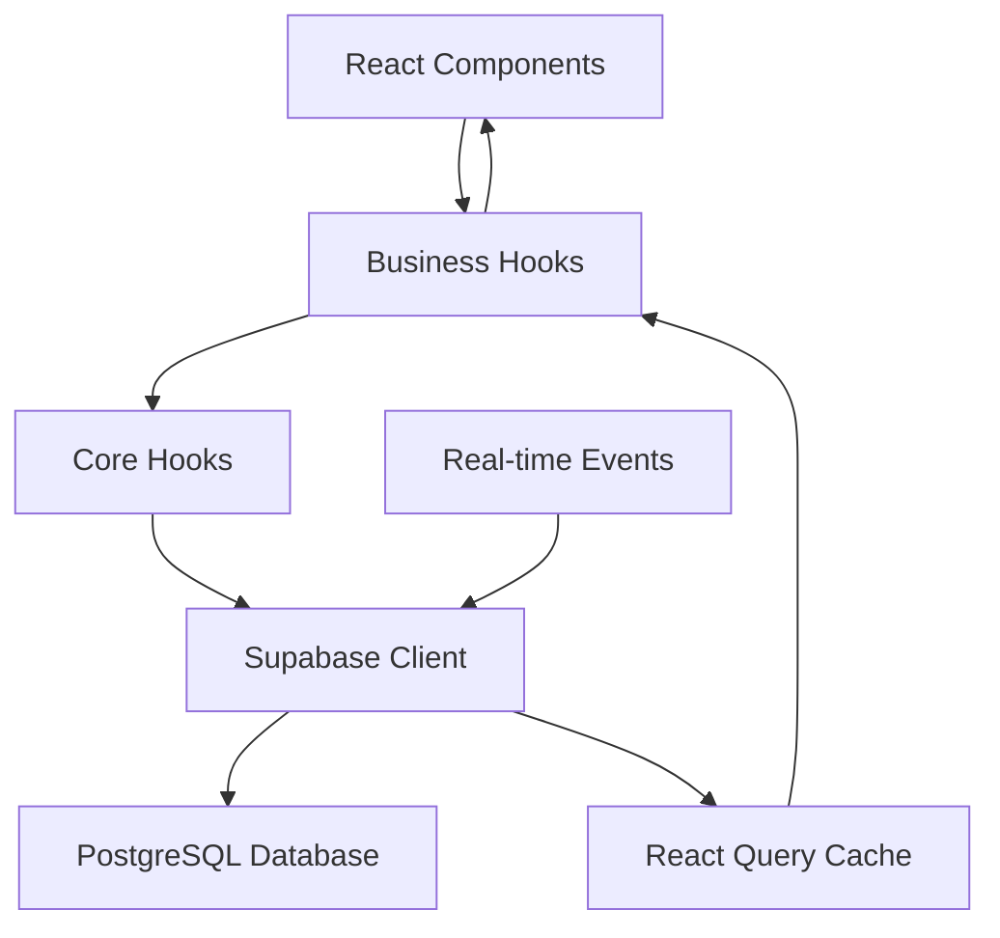

# Hook 维护文档

## 📖 概述

本文档为高新区工资信息管理系统的 React Hooks 架构提供全面的维护指南。涵盖架构设计、开发规范、测试策略、故障排除和最佳实践。

## 🏗️ 架构总览

### Hook 分层架构

```
src/hooks/
├── core/                    # 🔧 核心基础设施层
│   ├── useErrorHandler.ts      # 统一错误处理
│   ├── useLoadingState.ts      # 加载状态管理
│   └── useResource.ts          # 通用资源管理
├── infrastructure/         # 🔐 基础设施层
│   ├── useAuth.ts              # 认证与授权
│   ├── useRealtimeConnection.ts # 实时连接
│   └── usePerformanceMonitor.ts # 性能监控
└── business/               # 🏢 业务逻辑层
    ├── employee/               # 员工管理
    ├── payroll/                # 薪资管理（新工作流）
    ├── department/             # 部门管理
    └── dashboard/              # 仪表盘
```

### 数据流架构



## 🎯 Hook 设计原则

### 1. 单一职责原则
每个 Hook 应该只负责一个明确的业务领域或功能。

```typescript
// ✅ 好的示例 - 职责明确
export function useEmployeeList() {
  // 只处理员工列表相关逻辑
}

// ❌ 避免 - 职责混乱
export function useEmployeeAndPayroll() {
  // 混合了员工和薪资逻辑
}
```

### 2. 组合优于继承
通过组合多个小 Hook 来构建复杂功能。

```typescript
// ✅ 组合模式
export function usePayrollWorkflow() {
  const periodHook = usePayrollPeriod();
  const categoryHook = useEmployeeCategory();
  const positionHook = useEmployeePosition();
  
  // 编排逻辑
  return { /* 组合结果 */ };
}
```

### 3. 统一的返回结构
所有 Hook 应该遵循一致的返回结构。

```typescript
// 标准返回结构
interface StandardHookReturn<T> {
  // 数据
  data: T[];
  currentItem?: T;
  
  // 状态
  loading: {
    isLoading: boolean;
    isCreating: boolean;
    isUpdating: boolean;
    isDeleting: boolean;
  };
  
  // 错误
  errors: {
    loadError?: Error;
    mutationError?: Error;
  };
  
  // 操作
  actions: {
    create: (data: CreateInput) => Promise<T>;
    update: (id: string, data: UpdateInput) => Promise<T>;
    delete: (id: string) => Promise<void>;
    refresh: () => Promise<void>;
  };
  
  // 工具
  utils: {
    formatters: Record<string, Function>;
    validators: Record<string, Function>;
  };
}
```

## 📝 开发规范

### 文件命名和结构

```
src/hooks/[domain]/
├── index.ts                 # 统一导出
├── use[DomainName].ts       # 主 Hook
├── use[Feature]List.ts      # 列表管理
├── use[Feature]Detail.ts    # 详情管理
└── use[Feature]Form.ts      # 表单管理
```

### Hook 模板

```typescript
import { useMutation, useQuery, useQueryClient } from '@tanstack/react-query';
import { useEffect } from 'react';
import { supabase } from '@/lib/supabase';
import { useErrorHandler } from '@/hooks/core/useErrorHandler';
import type { Database } from '@/types/supabase';

// 类型定义
type Entity = Database['public']['Tables']['table_name']['Row'];
type EntityInsert = Database['public']['Tables']['table_name']['Insert'];
type EntityUpdate = Database['public']['Tables']['table_name']['Update'];

// 查询键管理
export const entityQueryKeys = {
  all: ['entity'] as const,
  lists: () => [...entityQueryKeys.all, 'list'] as const,
  list: (filters: any) => [...entityQueryKeys.lists(), filters] as const,
  details: () => [...entityQueryKeys.all, 'detail'] as const,
  detail: (id: string) => [...entityQueryKeys.details(), id] as const,
};

// Hook 配置选项
interface UseEntityOptions {
  entityId?: string;
  filters?: any;
  enableRealtime?: boolean;
}

// 主 Hook
export function useEntity(options: UseEntityOptions = {}) {
  const { entityId, filters, enableRealtime = true } = options;
  const queryClient = useQueryClient();
  const { handleError } = useErrorHandler();

  // 查询逻辑
  const listQuery = useQuery({
    queryKey: entityQueryKeys.list(filters),
    queryFn: async () => {
      const { data, error } = await supabase
        .from('table_name')
        .select('*')
        .match(filters || {});

      if (error) {
        handleError(error, { customMessage: '获取数据失败' });
        throw error;
      }

      return data || [];
    },
    staleTime: 5 * 60 * 1000,
  });

  // 变更操作
  const createMutation = useMutation({
    mutationFn: async (data: EntityInsert) => {
      const { data: result, error } = await supabase
        .from('table_name')
        .insert(data)
        .select()
        .single();

      if (error) {
        handleError(error, { customMessage: '创建失败' });
        throw error;
      }

      return result;
    },
    onSuccess: () => {
      queryClient.invalidateQueries({ queryKey: entityQueryKeys.all });
    },
  });

  // 实时订阅
  useEffect(() => {
    if (!enableRealtime) return;

    const channel = supabase
      .channel('entity-changes')
      .on('postgres_changes', 
        { event: '*', schema: 'public', table: 'table_name' },
        () => {
          queryClient.invalidateQueries({ queryKey: entityQueryKeys.all });
        }
      )
      .subscribe();

    return () => {
      channel.unsubscribe();
    };
  }, [enableRealtime, queryClient]);

  return {
    // 数据
    entities: listQuery.data || [],
    
    // 状态
    loading: {
      isLoading: listQuery.isLoading,
      isCreating: createMutation.isPending,
    },
    
    // 错误
    errors: {
      loadError: listQuery.error,
      mutationError: createMutation.error,
    },
    
    // 操作
    actions: {
      create: createMutation.mutate,
      refresh: listQuery.refetch,
    },
    
    // 工具
    utils: {
      // 工具函数
    },
  };
}
```

### 查询键命名规范

```typescript
// 标准命名模式
export const [domain]QueryKeys = {
  all: ['domain'] as const,
  lists: () => [...domainQueryKeys.all, 'list'] as const,
  list: (filters: any) => [...domainQueryKeys.lists(), filters] as const,
  details: () => [...domainQueryKeys.all, 'detail'] as const,
  detail: (id: string) => [...domainQueryKeys.details(), id] as const,
  related: (id: string, relation: string) => 
    [...domainQueryKeys.detail(id), 'related', relation] as const,
};
```

## 🧪 测试策略

### 单元测试模板

```typescript
// src/hooks/__tests__/useEntity.test.ts
import { renderHook, waitFor } from '@testing-library/react';
import { QueryClient, QueryClientProvider } from '@tanstack/react-query';
import { useEntity } from '../useEntity';

const createWrapper = () => {
  const queryClient = new QueryClient({
    defaultOptions: {
      queries: { retry: false },
      mutations: { retry: false },
    },
  });

  return ({ children }: { children: React.ReactNode }) => (
    <QueryClientProvider client={queryClient}>
      {children}
    </QueryClientProvider>
  );
};

describe('useEntity', () => {
  it('should fetch entities successfully', async () => {
    const { result } = renderHook(() => useEntity(), {
      wrapper: createWrapper(),
    });

    await waitFor(() => {
      expect(result.current.loading.isLoading).toBe(false);
    });

    expect(result.current.entities).toBeDefined();
  });

  it('should handle create mutation', async () => {
    const { result } = renderHook(() => useEntity(), {
      wrapper: createWrapper(),
    });

    act(() => {
      result.current.actions.create({
        name: 'Test Entity',
      });
    });

    await waitFor(() => {
      expect(result.current.loading.isCreating).toBe(false);
    });
  });
});
```

### 集成测试

```typescript
// src/hooks/__tests__/payroll-workflow.integration.test.ts
describe('Payroll Workflow Integration', () => {
  it('should complete full payroll creation workflow', async () => {
    // 测试完整工作流
    const { result } = renderHook(() => usePayrollWorkflow());
    
    // 1. 创建周期
    await act(async () => {
      await result.current.hooks.period.actions.create({
        period_year: 2025,
        period_month: 1,
      });
    });
    
    // 2. 分配员工类别
    // 3. 分配职位
    // 4. 设置缴费基数
    // 5. 创建薪资记录
    
    expect(result.current.progress.createdPayrolls).toBeGreaterThan(0);
  });
});
```

## 🔧 维护指南

### 常见问题排查

#### 1. React Query 缓存问题

**症状**: 数据不更新或显示过期数据

**排查步骤**:
```typescript
// 检查查询键是否正确
console.log('Query Key:', entityQueryKeys.list(filters));

// 手动失效缓存
queryClient.invalidateQueries({ queryKey: entityQueryKeys.all });

// 检查 staleTime 设置
// staleTime 太长可能导致数据不刷新
```

**解决方案**:
```typescript
// 1. 确保查询键唯一性
const queryKey = useMemo(() => 
  entityQueryKeys.list({ ...filters, timestamp: Date.now() })
, [filters]);

// 2. 适当的 staleTime
staleTime: 5 * 60 * 1000, // 5分钟，根据业务需求调整

// 3. 在关键操作后手动失效
onSuccess: () => {
  queryClient.invalidateQueries({ queryKey: entityQueryKeys.all });
}
```

#### 2. 实时订阅不工作

**症状**: 数据变更不能实时反映

**排查步骤**:
```typescript
// 检查 Supabase 连接
const channel = supabase.channel('test')
  .on('postgres_changes', { event: '*', schema: 'public', table: 'test' }, 
    (payload) => console.log('Change detected:', payload)
  )
  .subscribe((status) => console.log('Subscription status:', status));
```

**解决方案**:
```typescript
// 确保正确的清理
useEffect(() => {
  const channel = supabase.channel(`entity-${Date.now()}`) // 唯一频道名
    .on('postgres_changes', config, handler)
    .subscribe();

  return () => {
    channel.unsubscribe(); // 重要：清理订阅
  };
}, [dependencies]); // 确保依赖数组正确
```

#### 3. 内存泄漏

**症状**: 页面切换后内存持续增长

**排查步骤**:
```typescript
// 使用 React DevTools Profiler
// 检查是否有未清理的订阅和定时器
```

**解决方案**:
```typescript
// 确保所有副作用都有清理函数
useEffect(() => {
  const subscription = createSubscription();
  const timer = setInterval(callback, 1000);
  
  return () => {
    subscription.unsubscribe();
    clearInterval(timer);
  };
}, []);
```

### 性能优化

#### 1. 查询优化

```typescript
// ✅ 使用 select 限制返回字段
const { data } = await supabase
  .from('employees')
  .select('id, employee_name, department_id') // 只选择需要的字段
  .limit(50); // 限制返回数量

// ✅ 使用索引友好的查询
const { data } = await supabase
  .from('payrolls')
  .select('*')
  .eq('period_id', periodId) // 确保 period_id 有索引
  .order('created_at', { ascending: false });
```

#### 2. 缓存策略

```typescript
// 不同数据的缓存策略
const cacheConfig = {
  // 静态数据：长缓存
  staticData: { staleTime: 30 * 60 * 1000 }, // 30分钟
  
  // 动态数据：短缓存
  dynamicData: { staleTime: 1 * 60 * 1000 }, // 1分钟
  
  // 实时数据：无缓存
  realtimeData: { staleTime: 0 },
};
```

#### 3. 批量操作优化

```typescript
// ✅ 使用 upsert 进行批量操作
const batchUpsert = async (records: Record[]) => {
  const { data, error } = await supabase
    .from('table_name')
    .upsert(records, { 
      onConflict: 'unique_column',
      count: 'planned'  // 返回影响行数
    });
    
  return { data, count: data?.length || 0 };
};
```

## 📊 监控和调试

### 开发工具

```typescript
// 开发环境调试工具
if (process.env.NODE_ENV === 'development') {
  // React Query DevTools
  import { ReactQueryDevtools } from '@tanstack/react-query-devtools';
  
  // Hook 调试
  const useDebugHook = (hookName: string, value: any) => {
    useEffect(() => {
      console.group(`🪝 ${hookName}`);
      console.log('State:', value);
      console.groupEnd();
    }, [hookName, value]);
  };
}
```

### 错误监控

```typescript
// 错误边界组件
export const HookErrorBoundary: React.FC<{ children: React.ReactNode }> = ({ children }) => {
  return (
    <ErrorBoundary
      FallbackComponent={({ error, resetErrorBoundary }) => (
        <div className="alert alert-error">
          <h3>Hook 执行错误</h3>
          <pre>{error.message}</pre>
          <button onClick={resetErrorBoundary}>重试</button>
        </div>
      )}
      onError={(error, errorInfo) => {
        console.error('Hook Error:', error, errorInfo);
        // 发送到监控服务
      }}
    >
      {children}
    </ErrorBoundary>
  );
};
```

### 性能监控

```typescript
// Hook 性能监控
export const usePerformanceTracking = (hookName: string) => {
  const startTime = useRef(Date.now());
  
  useEffect(() => {
    const endTime = Date.now();
    const duration = endTime - startTime.current;
    
    if (duration > 1000) { // 超过1秒警告
      console.warn(`🐌 ${hookName} 执行时间过长: ${duration}ms`);
    }
  });
};
```

## 🚀 部署和发布

### 版本管理

```typescript
// Hook 版本标记
export const HOOK_VERSION = {
  core: '2.0.0',
  payroll: '3.0.0', // 新工作流版本
  employee: '1.5.0',
};

// 向后兼容性检查
export const checkHookCompatibility = (requiredVersion: string) => {
  // 版本兼容性逻辑
};
```

### 发布检查清单

- [ ] 所有 Hook 单元测试通过
- [ ] 集成测试覆盖主要流程
- [ ] TypeScript 类型检查无错误
- [ ] ESLint 检查通过
- [ ] 性能基准测试达标
- [ ] 文档更新完成
- [ ] 向后兼容性验证

## 📚 最佳实践

### 1. Hook 组合模式

```typescript
// ✅ 推荐：组合小粒度 Hook
export function usePayrollDashboard() {
  const statistics = usePayrollStatistics();
  const recentPayrolls = usePayrolls({ limit: 10 });
  const pendingApprovals = usePayrolls({ status: 'pending' });
  
  return {
    statistics: statistics.data,
    recentPayrolls: recentPayrolls.data,
    pendingApprovals: pendingApprovals.data,
    loading: statistics.loading || recentPayrolls.loading,
  };
}
```

### 2. 错误处理策略

```typescript
// 分层错误处理
export function useRobustHook() {
  const { handleError } = useErrorHandler();
  
  const query = useQuery({
    queryFn: async () => {
      try {
        const result = await apiCall();
        return result;
      } catch (error) {
        // 业务层错误处理
        if (error.code === 'BUSINESS_ERROR') {
          handleError(error, { 
            customMessage: '业务逻辑错误',
            showToast: true 
          });
        }
        throw error;
      }
    },
    retry: (failureCount, error) => {
      // 智能重试策略
      if (error.code === 'NETWORK_ERROR' && failureCount < 3) {
        return true;
      }
      return false;
    },
  });
  
  return query;
}
```

### 3. 类型安全实践

```typescript
// 严格的类型定义
interface StrictHookOptions<T> {
  filters?: Partial<T>;
  sortBy?: keyof T;
  enabled?: boolean;
}

export function useTypedHook<T extends Record<string, any>>(
  options: StrictHookOptions<T> = {}
): TypedHookReturn<T> {
  // 类型安全的实现
}
```

## 🔮 未来规划

### 短期目标（1-2周）
- [ ] 完成剩余 17 个服务文件的迁移
- [ ] 补充缺失的单元测试
- [ ] 性能优化和基准测试

### 中期目标（1-2个月）
- [ ] Hook 生态系统完善
- [ ] 自动化测试覆盖率达到 90%
- [ ] 开发者工具和调试工具完善

### 长期目标（3-6个月）
- [ ] Hook 库标准化和开源
- [ ] 跨项目复用框架
- [ ] AI 辅助 Hook 生成工具

## 📞 支持和贡献

### 获取帮助
- 📚 查阅本文档和代码注释
- 🐛 在项目 Issue 中报告问题  
- 💬 团队内部技术讨论

### 贡献指南
1. 遵循现有的代码风格和命名规范
2. 为新 Hook 添加完整的 TypeScript 类型
3. 编写单元测试和集成测试
4. 更新相关文档

---

**维护团队**: 前端开发组  
**最后更新**: 2025-01-14  
**文档版本**: 1.0.0