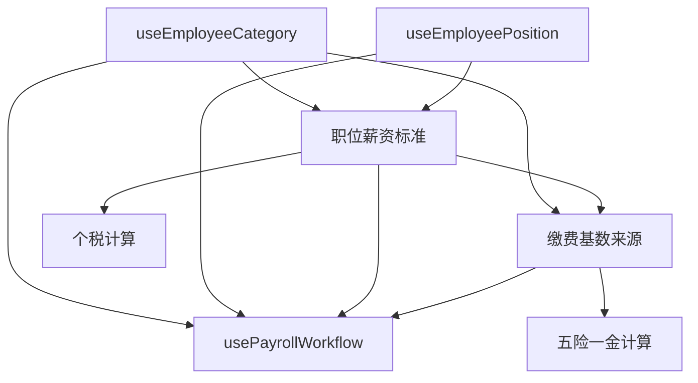

# 薪资创建流程 Hooks 架构设计

## 一、业务流程概述

完整的薪资创建流程包含以下核心模块：
1. **员工身份类别管理** - 确定员工类型（正式员工、合同工、临时工等）
2. **员工职务信息管理** - 管理员工的职位、级别、部门关系
3. **收入明细管理** - 录入和管理各项收入（基本工资、津贴、奖金等）
4. **缴费基数管理** - 设置五险一金的缴费基数
5. **个人所得税计算** - 根据收入自动计算个税

## 二、Hooks 架构设计

### 1. useEmployeeCategory - 员工身份类别 Hook

```typescript
// src/hooks/payroll/useEmployeeCategory.ts

interface UseEmployeeCategoryOptions {
  employeeId?: string;
  enableAutoFetch?: boolean;
}

interface EmployeeCategory {
  id: string;
  employee_id: string;
  category_id: string;
  category_name: string;
  effective_date: string;
  end_date?: string;
  is_active: boolean;
  // 类别相关的薪资规则
  salary_rules?: {
    has_social_insurance: boolean;
    has_housing_fund: boolean;
    tax_calculation_method: 'standard' | 'simplified' | 'exempt';
    overtime_rate_multiplier: number;
  };
}

export function useEmployeeCategory(options: UseEmployeeCategoryOptions) {
  // 查询
  - useEmployeeCategories() // 获取所有类别
  - useEmployeeCategoryHistory() // 获取员工类别历史
  - useCurrentEmployeeCategory() // 获取当前有效类别
  
  // 变更
  - useUpdateEmployeeCategory() // 更新员工类别
  - useCreateCategoryAssignment() // 分配新类别
  - useTerminateCategoryAssignment() // 终止类别分配
  
  // 验证
  - validateCategoryChange() // 验证类别变更合规性
  - checkCategoryConflicts() // 检查类别冲突
  
  return {
    categories,
    currentCategory,
    categoryHistory,
    mutations: {
      updateCategory,
      assignCategory,
      terminateCategory
    },
    validation: {
      canChangeCategory,
      hasConflicts
    }
  };
}
```

### 2. useEmployeePosition - 员工职务信息 Hook

```typescript
// src/hooks/payroll/useEmployeePosition.ts

interface UseEmployeePositionOptions {
  employeeId?: string;
  departmentId?: string;
  includeHistory?: boolean;
}

interface EmployeePosition {
  id: string;
  employee_id: string;
  position_id: string;
  position_name: string;
  department_id: string;
  department_name: string;
  grade_level?: string;
  effective_date: string;
  end_date?: string;
  is_primary: boolean;
  // 职位相关的薪资标准
  salary_grade?: {
    min_salary: number;
    max_salary: number;
    standard_salary: number;
    allowances: Array<{
      type: string;
      amount: number;
    }>;
  };
}

export function useEmployeePosition(options: UseEmployeePositionOptions) {
  // 查询
  - usePositions() // 获取所有职位
  - useEmployeePositions() // 获取员工职位（支持兼职）
  - usePositionHistory() // 职位变动历史
  - useDepartmentPositions() // 部门职位列表
  
  // 变更
  - useAssignPosition() // 分配职位
  - useUpdatePosition() // 更新职位信息
  - useTransferPosition() // 职位调动
  - usePromoteEmployee() // 晋升
  
  // 分析
  - usePositionSalaryRange() // 获取职位薪资范围
  - usePositionHeadcount() // 职位编制情况
  
  return {
    positions,
    employeePositions,
    primaryPosition,
    positionHistory,
    mutations: {
      assignPosition,
      updatePosition,
      transferPosition,
      promoteEmployee
    },
    analytics: {
      salaryRange,
      headcount,
      vacancies
    }
  };
}
```

### 3. usePayrollEarnings - 收入明细管理 Hook

```typescript
// src/hooks/payroll/usePayrollEarnings.ts

interface UsePayrollEarningsOptions {
  payrollId?: string;
  employeeId?: string;
  periodStart?: string;
  periodEnd?: string;
}

interface PayrollEarning {
  id: string;
  payroll_id: string;
  component_id: string;
  component_name: string;
  component_type: 'earning'; // 仅处理收入项
  category: 'basic_salary' | 'allowance' | 'bonus' | 'overtime' | 'other';
  amount: number;
  is_taxable: boolean;
  is_social_insurance_base: boolean;
  is_housing_fund_base: boolean;
  calculation_method: 'fixed' | 'percentage' | 'formula';
  calculation_config?: {
    base_amount?: number;
    percentage?: number;
    formula?: string;
  };
  notes?: string;
}

export function usePayrollEarnings(options: UsePayrollEarningsOptions) {
  // 查询
  - useEarningComponents() // 获取所有收入组件定义
  - usePayrollEarnings() // 获取薪资收入明细
  - useEmployeeEarningHistory() // 员工收入历史
  - useEarningTemplates() // 收入模板
  
  // 创建和更新
  - useCreateEarning() // 添加收入项
  - useUpdateEarning() // 更新收入项
  - useBatchCreateEarnings() // 批量添加收入
  - useApplyEarningTemplate() // 应用收入模板
  
  // 计算
  - useCalculateGrossPay() // 计算总收入
  - useCalculateTaxableIncome() // 计算应税收入
  - useCalculateInsuranceBase() // 计算社保基数
  
  // 个税计算
  - useCalculateIncomeTax() // 计算个人所得税
  - useTaxDeductions() // 获取专项扣除
  - useTaxThresholds() // 获取税率表
  
  return {
    earningComponents,
    earnings,
    earningHistory,
    calculations: {
      grossPay,
      taxableIncome,
      insuranceBase,
      incomeTax,
      netIncome
    },
    mutations: {
      createEarning,
      updateEarning,
      batchCreateEarnings,
      applyTemplate,
      calculateTax
    },
    templates,
    taxInfo: {
      deductions,
      thresholds,
      taxAmount,
      afterTaxIncome
    }
  };
}
```

### 4. useContributionBase - 缴费基数管理 Hook

```typescript
// src/hooks/payroll/useContributionBase.ts

interface UseContributionBaseOptions {
  employeeId?: string;
  yearMonth?: string;
  insuranceTypeId?: string;
}

interface ContributionBase {
  id: string;
  employee_id: string;
  insurance_type_id: string;
  insurance_type_name: string;
  base_amount: number;
  effective_start_date: string;
  effective_end_date?: string;
  calculation_method: 'actual_salary' | 'fixed' | 'city_average' | 'minimum' | 'maximum';
  city_config?: {
    city_average: number;
    minimum_base: number;
    maximum_base: number;
    employee_rate: number;
    employer_rate: number;
  };
  adjustment_reason?: string;
}

export function useContributionBase(options: UseContributionBaseOptions) {
  // 查询
  - useInsuranceTypes() // 获取所有保险类型
  - useContributionBases() // 获取缴费基数
  - useContributionBaseHistory() // 基数调整历史
  - useCityInsuranceConfig() // 城市社保配置
  
  // 设置和调整
  - useSetContributionBase() // 设置缴费基数
  - useAdjustContributionBase() // 调整缴费基数
  - useBatchSetBases() // 批量设置基数
  - useAutoCalculateBase() // 自动计算基数
  
  // 计算
  - useCalculateContributions() // 计算缴费金额
  - useValidateBaseRange() // 验证基数范围
  - useProjectContributions() // 预测缴费
  
  return {
    insuranceTypes,
    contributionBases,
    baseHistory,
    cityConfig,
    calculations: {
      employeeContribution,
      employerContribution,
      totalContribution
    },
    mutations: {
      setBase,
      adjustBase,
      batchSetBases,
      autoCalculate
    },
    validation: {
      isValidBase,
      baseRange,
      warnings
    }
  };
}
```

### 5. usePayrollWorkflow - 薪资创建流程编排 Hook

```typescript
// src/hooks/payroll/usePayrollWorkflow.ts

interface UsePayrollWorkflowOptions {
  mode: 'single' | 'batch';
  employeeIds?: string[];
  periodStart: string;
  periodEnd: string;
}

interface PayrollWorkflowState {
  currentStep: number;
  totalSteps: number;
  stepStatus: Record<string, 'pending' | 'processing' | 'completed' | 'error'>;
  errors: Array<{ step: string; message: string; }>;
  warnings: Array<{ step: string; message: string; }>;
}

export function usePayrollWorkflow(options: UsePayrollWorkflowOptions) {
  // 使用其他 hooks
  const employeeCategory = useEmployeeCategory();
  const employeePosition = useEmployeePosition();
  const payrollEarnings = usePayrollEarnings();
  const contributionBase = useContributionBase();
  const payroll = usePayroll();
  
  // 流程步骤
  const workflowSteps = [
    { id: 'validate_employees', name: '验证员工信息' },
    { id: 'check_category', name: '检查身份类别' },
    { id: 'verify_position', name: '核实职务信息' },
    { id: 'create_payroll', name: '创建薪资记录' },
    { id: 'setup_earnings', name: '设置收入项' },
    { id: 'calculate_base', name: '计算缴费基数' },
    { id: 'calculate_insurance', name: '计算五险一金' },
    { id: 'calculate_tax', name: '计算个人所得税' },
    { id: 'finalize', name: '完成薪资创建' }
  ];
  
  // 执行流程
  const executeWorkflow = async () => {
    // Step 1: 验证员工信息
    await validateEmployees();
    
    // Step 2: 检查并更新身份类别
    await checkAndUpdateCategories();
    
    // Step 3: 核实职务信息
    await verifyPositions();
    
    // Step 4: 创建薪资记录
    const payrollRecords = await createPayrollRecords();
    
    // Step 5: 设置收入项
    await setupEarnings(payrollRecords);
    
    // Step 6: 计算缴费基数
    await calculateContributionBases(payrollRecords);
    
    // Step 7: 计算五险一金
    await calculateInsurance(payrollRecords);
    
    // Step 8: 计算个税
    await calculateIncomeTax(payrollRecords);
    
    // Step 9: 完成创建
    await finalizePayrolls(payrollRecords);
  };
  
  // 单步执行
  const executeStep = async (stepId: string) => {
    // 执行特定步骤
  };
  
  // 回滚
  const rollback = async (toStep?: number) => {
    // 回滚到指定步骤
  };
  
  return {
    // 状态
    workflowState,
    currentStep: workflowSteps[workflowState.currentStep],
    progress: (workflowState.currentStep / totalSteps) * 100,
    
    // 操作
    actions: {
      start: executeWorkflow,
      executeStep,
      pause,
      resume,
      rollback,
      retry
    },
    
    // 数据
    data: {
      employees: validatedEmployees,
      payrolls: createdPayrolls,
      earnings: setupEarnings,
      contributions: calculatedContributions,
      taxes: calculatedTaxes
    },
    
    // 验证和错误
    validation: {
      canProceed,
      errors: workflowState.errors,
      warnings: workflowState.warnings
    }
  };
}
```

## 三、数据流设计

### 1. 依赖关系



### 2. 状态管理策略

```typescript
// 使用 Zustand 管理薪资创建流程的全局状态
// src/stores/payrollWorkflowStore.ts

interface PayrollWorkflowStore {
  // 流程状态
  isActive: boolean;
  currentWorkflowId: string;
  mode: 'single' | 'batch';
  
  // 数据缓存
  employeeData: Map<string, EmployeeFullData>;
  payrollDrafts: Map<string, PayrollDraft>;
  
  // 操作
  startWorkflow: (options: WorkflowOptions) => void;
  updateEmployeeData: (employeeId: string, data: Partial<EmployeeFullData>) => void;
  saveProgress: () => void;
  loadProgress: (workflowId: string) => void;
  clearWorkflow: () => void;
}
```

## 四、实现优先级

### Phase 1 - 基础功能（第一周）
1. ✅ usePayroll - 已完成
2. 🔄 useEmployeeCategory - 员工类别管理
3. 🔄 usePayrollEarnings - 收入明细（包含个税）

### Phase 2 - 核心功能（第二周）
4. useEmployeePosition - 职务信息
5. useContributionBase - 缴费基数

### Phase 3 - 流程整合（第三周）
6. usePayrollWorkflow - 流程编排
7. 创建完整的薪资创建向导页面
8. 测试和优化

## 五、测试策略

### 1. 单元测试
- 每个 hook 的独立功能测试
- 数据转换和计算逻辑测试
- 错误处理测试

### 2. 集成测试
- Hook 之间的数据流测试
- 完整流程测试
- 并发和事务测试

### 3. E2E 测试
- 完整的薪资创建流程
- 错误恢复和回滚
- 性能测试

## 六、注意事项

1. **事务一致性**: 确保多步骤操作的原子性
2. **性能优化**: 使用批量操作减少数据库调用
3. **错误恢复**: 实现断点续传和回滚机制
4. **数据验证**: 每一步都要验证数据完整性
5. **审计日志**: 记录所有关键操作
6. **权限控制**: 不同角色的操作权限
7. **缓存策略**: 合理使用 React Query 缓存
8. **实时更新**: 支持多用户协作场景